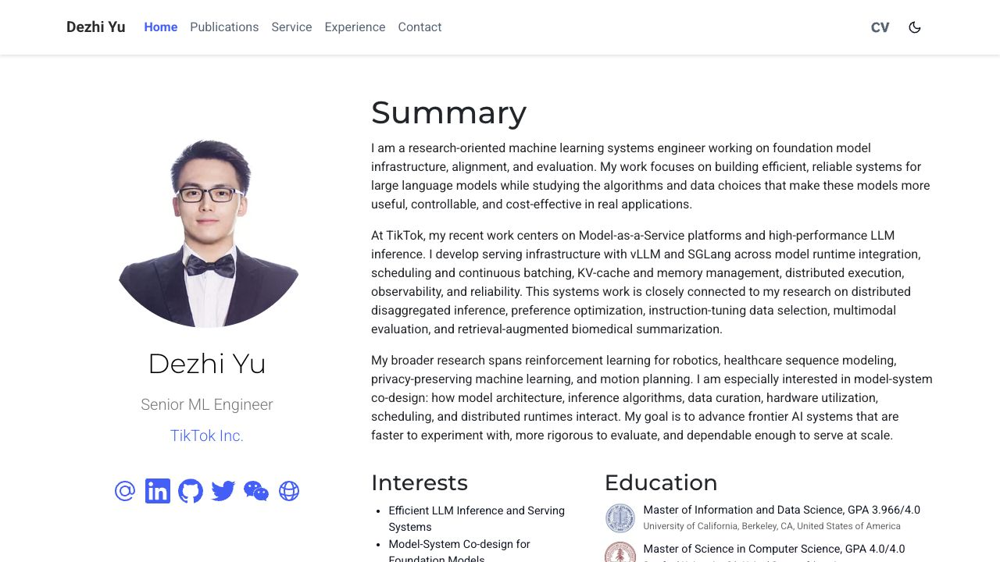
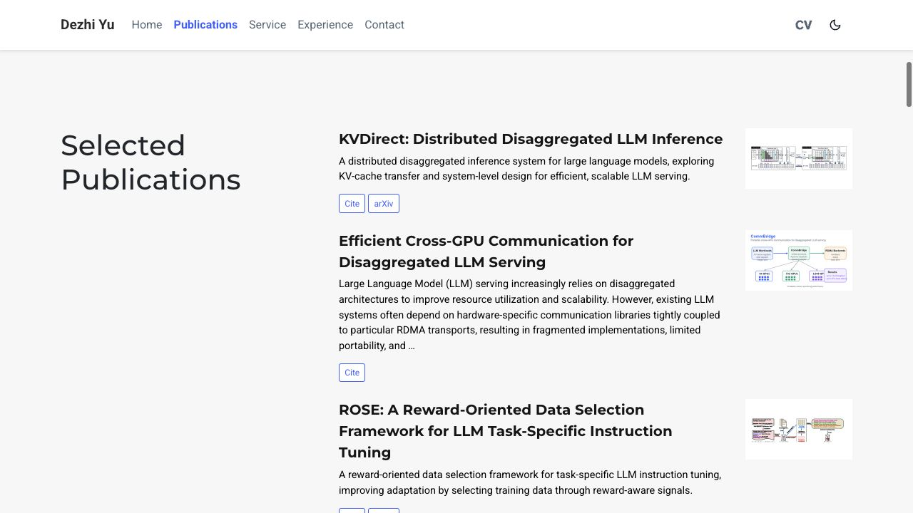

# Dezhi Yu Resume

Personal academic resume and research portfolio built with
[HugoBlox](https://hugoblox.com/) and Hugo Extended.

The site presents my research interests, education, selected publications,
academic service, professional experience, and contact information.

## Preview





## Highlights

- Research-focused biography and education history
- Selected publications with abstracts, citation data, and feature images
- Academic service and reviewing experience
- Professional experience in machine learning systems and infrastructure
- Responsive light and dark themes
- Optimized local assets and generated WebP images

## Development

```bash
pnpm install
pnpm run dev
```

The local site is served at `http://localhost:1313/`.

## Production Build

```bash
pnpm run build
```

The generated site is written to `public/`.
