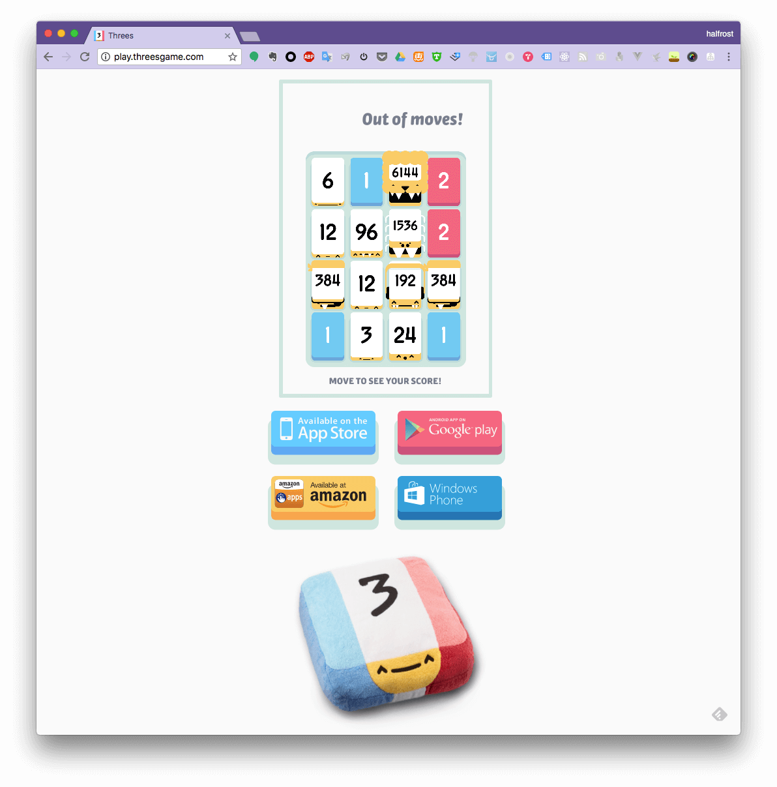
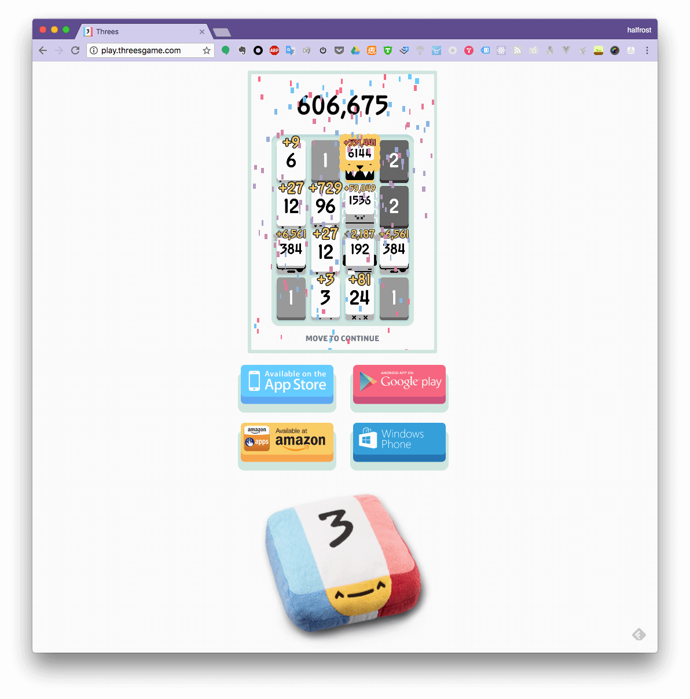
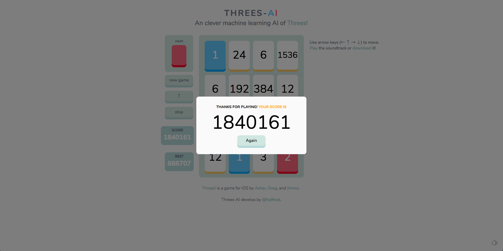

Web Live Demo 地址在 [这里](https://threes.halfrost.com) 

# 灵感来源

1 个月前和另外二位小伙伴一起参加了一个 AI 的比赛。虽然比赛结果不理想，至少我享受到了编程过程中的乐趣。从这次比赛中让我认识到 Go 除了写服务端，写游戏模拟器，写 AI 都是拿手好戏。最近微信跳一跳的辅助，冲顶大会的辅助基本也都是 Go 写的。于是我更坐不住了，也写一个来纪念我们那次比赛。

由于本人也是客户端出身，所以这个 AI 必须也能在手机上刷分。所以要找一个手机游戏，三个人可以玩的，或者名字带“三”字的，由此：

> Threes preson join one AI competition  ---> Threes-AI

# “炫耀”分数

目前这个 Go 版本的 AI 在 3 个地方跑了分，都分别跑了 200 盘。拿到高分的比例差不多就 20% 左右。所以也希望能在项目第二阶段——机器学习阶段，能把跑高分的比率提高到 100% 

## 1. play threes game 官方网站

这个网站就是官方游戏的 web 版了。

这个高分视频在这里，[腾讯视频链接](https://v.qq.com/x/page/w0559rco3qz.html)

## 2. threes Android 客户端

这里之所以没有跑 iOS 客户端的游戏截图，是因为 iOS 客户端需要越狱才能运行，笔者手头上的机器都在 iOS 11.2+，等以后越狱了可以再重新来跑跑分。

## 3. threes game 自建网站

为了能自己通过机器学习训练模型，也为了能公开展示这个 AI 的实力，于是按照官方的游戏规则，原汁原味的复刻了一个 web 版。

这个高分视频在这里，[腾讯视频链接](https://v.qq.com/x/page/e0559nle7dh.html)

(上面这个视频有人问怎么感觉是快放了的，其实没有，因为旁边时间可以看出来是标准的。那为什么会很快，当前线上的版本是加了 400 ms 移动动画的，我在本地训练的过程中，去掉了 400 ms 的动画时间，动画时间没有必要，所以上述视频会显得很快，其实 AI 是同一个)

在网络上流程着这样一个“谣传”：当合成出 12288 砖块的时候，即 2个 6144 砖块合并，游戏就会结束，开始播放游戏制作人的名单。在这个网站上并没有这个规则，能合成出多高的砖块都可以。分数没有上线，这样也可以充分检验 AI 的智慧。

当然针对官方的前 2 个游戏地址，笔者还真的没有合成出一次 12288 砖块，所以也无法验证“谣传”的真伪。100% 合成出 12288 砖块，也是本 AI 的目标。**暂时还没有达到目标**。

